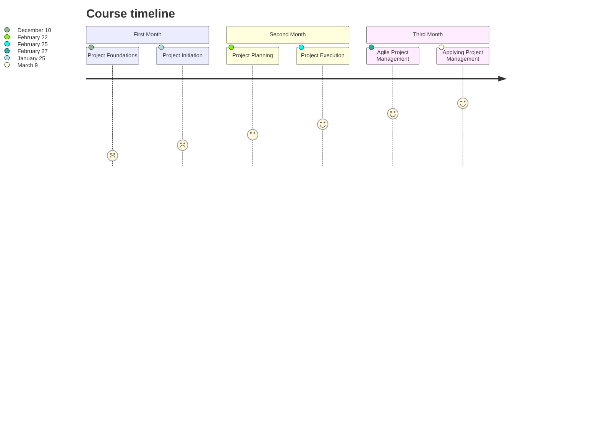

## The Learning Experience

The application of information, skills, tools, and strategies to meet project requirements and accomplish the desired outcome is known as project management.

### Skills a Project Manager will Demonstrate

| Project Manager                                                                                                |
|:--------------------------------------------------------------------------------------------------------------:|
| - Excellent **time management**, **prioitization**, and **organizational skills**                              |
| - Demonstrated **ability to lead** others                                                                      |
| - Outstanding **communication skills**                                                                         |
| - Successfull track record in **coordinating** the work of internal and external teams to develop new products |

Project managers oversee projects from inception to end and act as guides for their teams, relying on their exceptional organizational and interpersonal skills at all times.

I made the decision to embark on a 6-month intensive learning journey on Project Management.

I finished the course after 13 weeks of hard effort and perseverance. I struggled with depression on several occasions but never gave up. Upon the many challenges that I faced - light offs, procastination, slow internet connectivity, and many more, I am happy to pronounce a successful completion of the tranining.

### My Study Timeline

Every mentor in the course is fantastic; I learnt a lot from them. I am grateful to those who reviewed each of my assignments and provided helpful comments on my mistakes so that I could improve my project management skillsets. Overall, thank you to everyone.

## Capstone Project

In this section, I discuss the thought process, skills, and experience I gained while working on my Capstone project. The Captsone project gives one the opportunity to put their project management knowledge and skills to the test in a real-world simulation. I will be Peta, the Project Manager for this project.

## Overview

Sauce and Spoon, a small restaurant company, is trying to reach its annual expansion and growth targets. They've chosen to undertake a trial project to see how well new tabletop menu tablets will help them achieve these objectives. The new menu tablets will help Sauce and Spoon fulfill its business goals by allowing the restaurant to serve more clients in less time. They will also provide useful statistics.

As the company's first in-house project manager, I was tasked to handle the tablet rollout at two of the five restaurants in the company. Throughout you'll see how I lead the team through the process of planning and completing project deliverables.

You'll be able to follow the project throughout its life cycle as I learn about the restaurant industry, establish project goals, negotiate with stakeholders, and much more.

You'll see how I learned what works and what doesn't, as well as how to problem solve my way through the project, practice key project management concepts like analyzing materials to identify project requirements, solve problems, and manage stakeholders, using important negotiation and influencing techniques, listening with empathy when working with a team, and practicing stakeholder communication skills.

Are you ready? Let's go.

> **View all quiz results** [at the repository here](https://github.com/PatrickKyei/google-project-management-module) 
{: .prompt-info }

### Project Charter

A project charter is a formal document that clearly defines the project and outlines the necessary details to reach the project's goals.

Part of my roles was to draw a project charter.

The project charter contains the project scope, costs, and benefits to the project. This will later help me identify aspects of the project as being out-of-scope and add it to the charter.

The charter helps to lay out project goals, highlight benefits, and help keep stakeholders aligned.

I completed the project charter for my peers to review the completed project charter and provide feedback on each section.

_Project Charter_

[Request Access to View](https://docs.google.com/document/d/1r7pQvLhsMWIVXqDKd_7Ye9MHJtQTU60dGTweY3vKefk/edit?usp=sharing)

### Influential Email

A coalition is a temporary alliance or partnering of individuals or groups in order to achieve a common purpose or to engage in a joint activity.

Omar, the owner of Sauce & Spoon, has requested that we expand the tablet rollout to include all dining sections, not just the bar. Deanna expects Peta to do what she can to accommodate an expansion, but Peta feels it is outside the scope of the project. However, because Omar is the owner and a senior stakeholder, Peta decides to get input from other team members. She hopes to identify at least two team members who will support her position on keeping the rollout confined to the bar area. Peta meets with Gilly, Alex, Larissa, Zane, Seydou, and Carter to discuss the pros and cons of expanding the tablet rollout.

_Writing Influential Emails_

[Request Access to View](https://docs.google.com/document/d/1do4buT-AdSQ7VLdgGDhRpA7Jb2pNVP6aU3hkdQkT5lQ/edit?usp=sharing)

### Project Plan

The planning phase of a project involves the schedule, the budget, risk management.

_Project Plan_

[Request Access to View](https://docs.google.com/spreadsheets/d/1ah_RDH6w-i_x6dIoaOBxULTzNB8XjU7obxqiFu-uBhU/edit?usp=sharing&resourcekey=0-tt6gND6JhoxCJuPGMgb52w)

### Survey Questions

Peta has created evaluation questions and indicators to measure customer satisfaction during the test launch

_Survey Questions_

[Request Access to View](https://docs.google.com/spreadsheets/d/1ah_RDH6w-i_x6dIoaOBxULTzNB8XjU7obxqiFu-uBhU/edit?usp=sharing&resourcekey=0-tt6gND6JhoxCJuPGMgb52w)

### Project Evaluation and Findings

The test launch is complete and the team has compiled the survey results. Peta’s next task is to identify key data points from the survey responses and prepare a presentation. Her presentation should tell the story of the test launch, including what worked, what didn’t, and recommendations for next steps. She will present her findings to Omar, the CEO, Deanna, the Director of Operations, and several potential investors for the next tablet rollout project at the remaining Sauce & Spoon locations.

_Project Evaluations_

[Request Access to View](https://docs.google.com/presentation/d/1upWT9ggQZKE5Kad7LwMU5mhrLphjEO1AGIx3cgmgQnw/edit?usp=sharing)

### Email to Senior Stakeholers

Peta just found out that there has been an update to the tablet contract that affects the project budget. Based on this new information, Peta needs to explain the situation to Deanna and ask for specific guidance on how to proceed. Although Peta has interacted regularly with Deanna throughout the project, she is still a senior stakeholder who expects Peta to deliver the project goals on time and within budget. Peta keeps these facts in mind as she composes an email to Deanna.

_Writing Emails to Senior Stakeholders_

[Request Access to View](https://docs.google.com/document/d/1_XNaeos3HQTbY4NHQ1fRErUbe_JiolKWGApTeSog54c/edit?usp=sharing)

### Executive Summary

The Executive Summary summarizes the purpose and outcome of the tablet project.

_Executive Summary_

[Request Access to View](https://docs.google.com/presentation/d/1Oh_4SQiFDjsuw6Tm_bPYZeYy68uisLwMcG0FFr6g2d0/edit?usp=sharing)

There are many introductory-level positions one can explore traditional project management roles such as **Project Manager**, **Project Analyst**, **Project Leader/Director**, **Project Controller**, **Technical Project Manager**, **Project Management Office(PMO) Analyst**. Other names for Project Manager inlcudes Operations Manager, Program Manager, Operations Associate, Project Assistant.

[View my Credentials](https://www.credly.com/badges/6234bb3c-c69c-436e-a0b1-d454f394cf07?source=linked_in_profile). You can connect with me on [Linkedin](https://www.linkedin.com/in/patrickbaffour/)

## [Foundations Of Project Management - View Quiz Page](https://github.com/PatrickKyei/google-project-management-module)

1. When you review a job listing, which section offers the most insight when deciding if the role is well-suited for you?

- Job salary

- **Job description**

- Job benefits 

- Job location

> _Correct_  
The job description indicates that the job matches your skill set and experience. 
{: .prompt-tip }

2. Which of the following might be part of a job description for an entry-level project manager role?

- Our leadership team is currently looking for a Senior Project Manager to support our clients in the Life Sciences and Industrial sectors. 

- Our business group is hiring an experienced project management professional who has a broad understanding of solutions and industry best practices. 

- Our company is seeking a Program Manager with experience managing a team in the Agile framework.

- **Our North Coast branch needs a new Junior Project Manager who can channel drive and enthusiasm. You’ll be front and center, hands-on, and contributing your creative energy to high-impact projects.**

> _Correct_  
The term “Junior” typically refers to a newer role that requires less project management experience.{: .prompt-tip }

3. Which of the following best exemplifies the progression of a project management career?

- **Project manager to program manager to portfolio manager**

- Program manager to project manager to portfolio manager

- Project manager to portfolio manager to program manager

> _Correct_  
While you may encounter a different title progression in your career, this is a typical progression. All project managers lead projects from start to finish and serve as guides for their team. However, program managers are responsible for managing many projects at the same time, and portfolio managers are responsible for portfolios of projects or programs for one client. 
{: .prompt-tip }

4. What three types of information can be helpful to include in your search for project management roles?

- + [x] Skills you’ve acquired in your current or previous position

> _Correct_  
Including skills you’ve previously acquired in your job search can help you find jobs that match your experience. 
{: .prompt-tip }

- + [x] Common project management-related buzzwords like “process improvement” and “risk management”

> _Correct_  
Using common project management buzzwords in your job search can help you find both project management and project management-related roles, even if those roles do not include “project manager” in the title. 
{: .prompt-tip }

- Training you may gain later in your project management career

- + [x] Essential project management skills like coordination, organization, and leadership

 > _Correct_  
Using skills that are essential for all project managers in your job search can help you find both project management and project management-related roles, even if those roles do not include “project manager” in the title 
{: .prompt-tip }

> **View all quiz results** [at the repository here](https://github.com/PatrickKyei/google-project-management-module) 
{: .prompt-info }

## Conclusion

Some of the core competencies I developed during this program includes:

- Contract management
- Risk planning
- Project scoping and planning
- Process improvement
- Proficient in work management software and digital tools
- Team management
- Effective stakeholder communication
- Budgeting and cost analysis