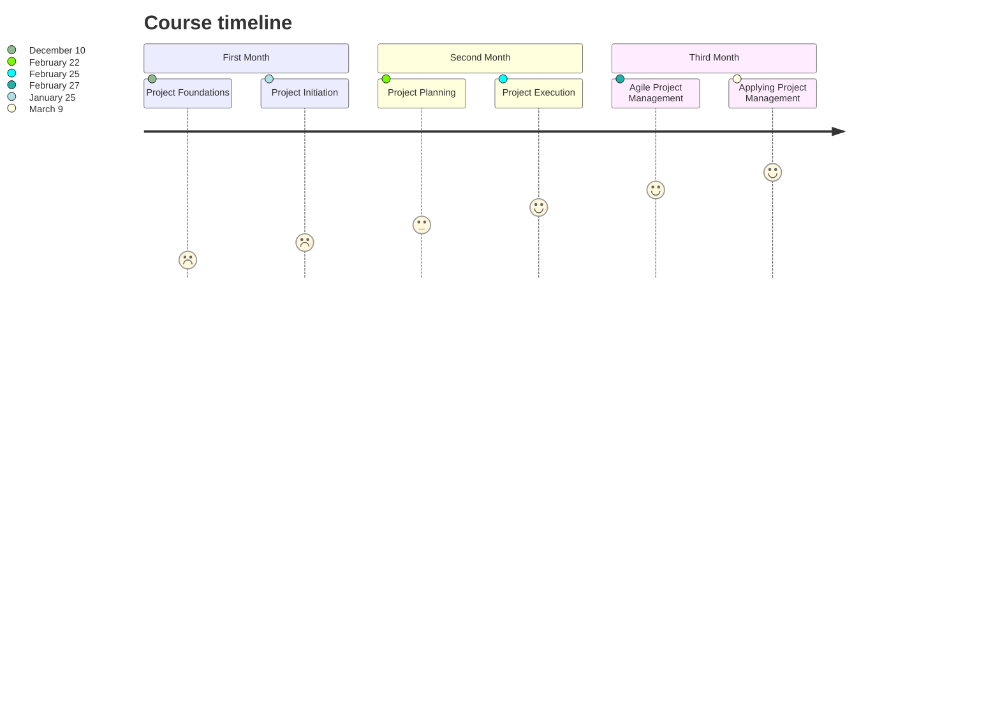

## The Learning Experience

The application of information, skills, tools, and strategies to meet project requirements and accomplish the desired outcome is known as project management.

### Skills a Project Manager will Demonstrate

| Project Manager                                                                                                |
|:--------------------------------------------------------------------------------------------------------------:|
| - Excellent **time management**, **prioitization**, and **organizational skills**                              |
| - Demonstrated **ability to lead** others                                                                      |
| - Outstanding **communication skills**                                                                         |
| - Successfull track record in **coordinating** the work of internal and external teams to develop new products |

Project managers oversee projects from inception to end and act as guides for their teams, relying on their exceptional organizational and interpersonal skills at all times.

According to Google, students who have completed a training or course Google Career Certificate in project management in the United States have reported a 75% improvement in their career trajectory.

I made the decision to embark on a 6-month intensive learning journey on Project Management.

I finished the course after 13 weeks of hard effort and perseverance. I struggled with depression on several occasions but never gave up. Upon the many challenges that I faced - light offs, procastination, slow internet connectivity, and many more, I am happy to pronounce a successful completion of the tranining.

### My Study Timeline

Every mentor in the course is fantastic; I learnt a lot from them. I am grateful to those who reviewed each of my assignments and provided helpful comments on my mistakes so that I could improve my project management abilities for them. Overall, thank you to everyone and please pray for me so that I can be successful with project management. Thanks.

## Capstone Project

In this section, I discuss the thought process, skills, and experience I gained while working on my Capstone project. The Captsone project gives you the opportunity to put your project management knowledge and skills to the test in a real-world simulation.

## Overview

Sauce and Spoon, a small restaurant company, is trying to reach its annual expansion and growth targets. They've chosen to undertake a trial project to see how well new tabletop menu tablets will help them achieve these objectives. The new menu tablets will help Sauce and Spoon fulfill its business goals by allowing the restaurant to serve more clients in less time. They will also provide useful statistics.

I was just hired as the company's first in-house project manager to handle the tablet rollout at two of the five restaurants in the company. Throughout you'll see how I lead the team through the process of planning and completing project deliverables.

You'll be able to follow the project throughout its life cycle as I learn about the restaurant industry, establish project goals, negotiate with stakeholders, and much more.

You'll see how I learned what works and what doesn't, as well as how to problem solve my way through the project, practice key project management concepts like analyzing materials to identify project requirements, solve problems, and manage stakeholders, using important negotiation and influencing techniques, listening with empathy when working with a team, and practicing stakeholder communication skills.

Are you ready? Let's go.

### Project Charter

A formal document that clearly defines the project and outlines the necessary details to reach the project's goals.

[Request Access](https://docs.google.com/document/d/1r7pQvLhsMWIVXqDKd_7Ye9MHJtQTU60dGTweY3vKefk/edit?usp=sharing)

### Influential Email

[Request Acces](https://docs.google.com/document/d/1do4buT-AdSQ7VLdgGDhRpA7Jb2pNVP6aU3hkdQkT5lQ/edit?usp=sharing)

### Project Plan

[Request Access](https://docs.google.com/spreadsheets/d/1ah_RDH6w-i_x6dIoaOBxULTzNB8XjU7obxqiFu-uBhU/edit?usp=sharing&resourcekey=0-tt6gND6JhoxCJuPGMgb52w)

### Survey Questions

[Request Access](https://docs.google.com/spreadsheets/d/1ah_RDH6w-i_x6dIoaOBxULTzNB8XjU7obxqiFu-uBhU/edit?usp=sharing&resourcekey=0-tt6gND6JhoxCJuPGMgb52w)

### Project Evaluation and Findings

[Requestion Access](https://docs.google.com/presentation/d/1upWT9ggQZKE5Kad7LwMU5mhrLphjEO1AGIx3cgmgQnw/edit?usp=sharing)

### Email to Senior Stakeholers

[Request Access](https://docs.google.com/document/d/1_XNaeos3HQTbY4NHQ1fRErUbe_JiolKWGApTeSog54c/edit?usp=sharing)

### Executive Summary

[Request Access](https://docs.google.com/presentation/d/1Oh_4SQiFDjsuw6Tm_bPYZeYy68uisLwMcG0FFr6g2d0/edit?usp=sharing)

### Conclusion
