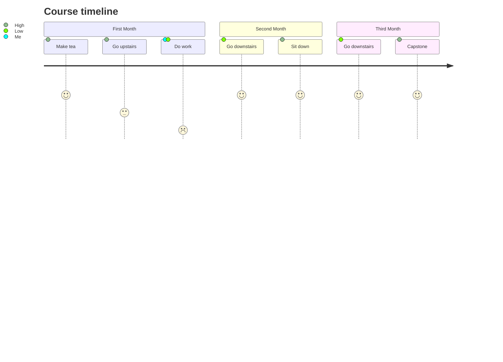

## The Learning Experience

The application of information, skills, tools, and strategies to meet project requirements and accomplish the desired outcome is known as project management.

### Skills a Project Manager will Demonstrate

| Project Manager                                                                                                |
|:--------------------------------------------------------------------------------------------------------------:|
| - Excellent **time management**, **prioitization**, and **organizational skills**                              |
| - Demonstrated **ability to lead** others                                                                      |
| - Outstanding **communication skills**                                                                         |
| - Successfull track record in **coordinating** the work of internal and external teams to develop new products |

Project managers oversee projects from inception to end and act as guides for their teams, relying on their exceptional organizational and interpersonal skills at all times.

According to Google, students who have completed a training or course Google Career Certificate in project management in the United States have reported a 75% improvement in their career trajectory.

I made the decision to embark on a 6-month intensive learning journey on Project Management.

I finished the course after 13 weeks of hard effort and perseverance. I struggled with depression on several occasions but never gave up. Upon the many challenges that I faced - light offs, procastination, slow internet connectivity, and many more, I am happy to pronounce a successful completion of the tranining.

### My Study Timeline

Every mentor in the course is fantastic; I learnt a lot from them. I am grateful to those who reviewed each of my assignments and provided helpful comments on my mistakes so that I could improve my project management abilities for them. Overall, thank you to everyone and please pray for me so that I can be successful with project management. Thanks.

## Capstone Project

In this section, I discuss the thought process, skills, and experience I gained while working on my Capstone project. The Captsone project gives you the opportunity to put your project management knowledge and skills to the test in a real-world simulation.

## Overview
